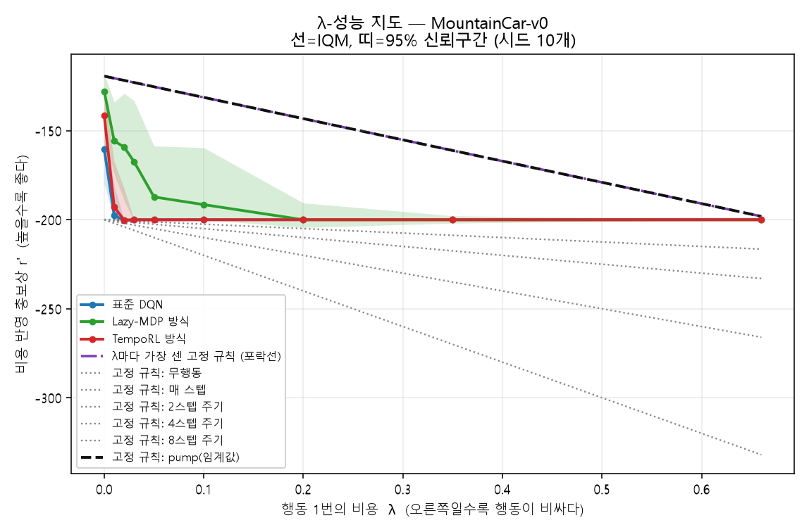
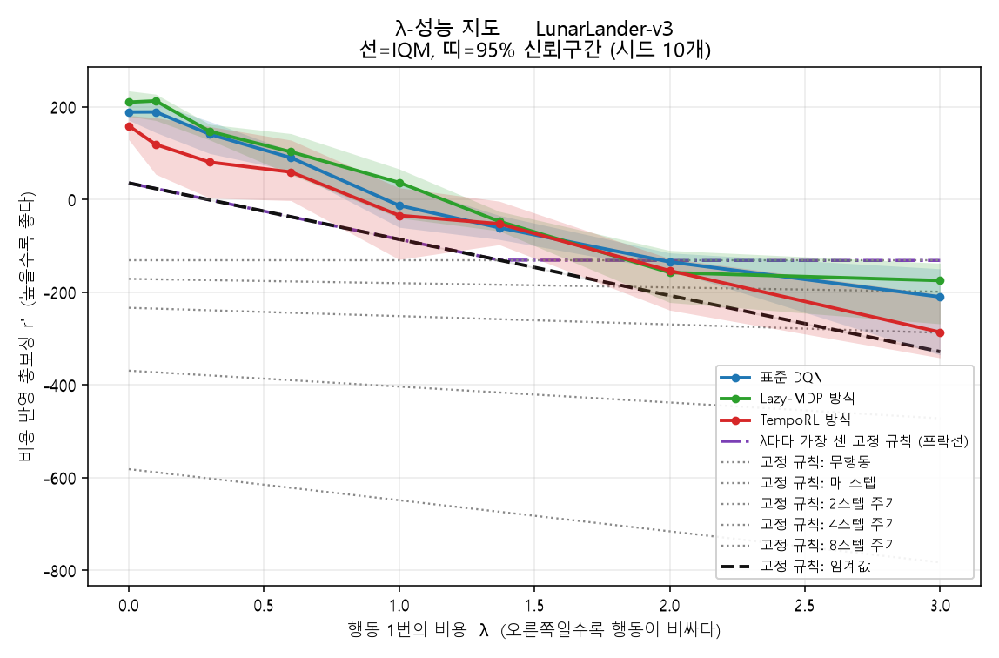

# When to Act — 행동 비용이 있는 환경에서 강화학습의 우위 조건 분석

> **EN summary** — In real control systems, every action has a cost (wear, energy, switching loss). This project sweeps an explicit action cost λ (reward shaped as `r' = r − λ·1[act]`) across Gymnasium environments (MountainCar, LunarLander, MinAtar) and asks: **at what cost level do agents that *learn when to act* (TempoRL-style action repetition, Lazy-MDP-style intervention) actually beat simple fixed rules** (act-every-k-steps, threshold triggers, no-op)? Results are reported with IQM and stratified bootstrap CIs over ≥10 seeds, following Agarwal et al. (NeurIPS 2021). Undergraduate thesis project, Dong-A University.

## 연구 질문

실제 기계 제어에서 행동은 공짜가 아니다 (마모, 전환 손실, 통신·연산 자원).
행동 1번마다 비용 λ를 물리면서 λ를 0부터 단계적으로 키우면 —

1. 학습 에이전트의 **행동 빈도**는 어떻게 변하는가?
2. **단순 고정 규칙 대비 성능 우위**는 어느 λ에서 사라지는가?

이를 통해 제어 문제에서 **"학습을 도입할 가치가 있는 조건"과 "단순 규칙이면 충분한 조건"** 을 구분하는 판단 근거를 제시한다.

## 방법

| 항목 | 내용 |
|---|---|
| 환경 | Gymnasium MountainCar-v0 · LunarLander-v3 · MinAtar Freeway — 보상에 행동 비용 항 추가 (`r' = r − λ·1[행동 실행]`). 세 환경은 '보상이 조밀한가 / 좋은 규칙이 있는가' 두 축에서 서로 다른 자리에 있다 |
| 비교 대상 | (가) 표준 DQN (나) TempoRL 방식 행동 지속 길이 학습 (다) Lazy-MDP 방식 개입 상태 선택 (라) 고정 규칙: k스텝 주기 행동 · 임계값 규칙 · 무행동 |
| 실험 축 | 행동 비용 λ 격자 × 무작위 시드 10개 이상. 여기에 **공정성 검사**(λ=0에서 예산을 늘려 재측정)와 **인과 검사**(비용을 켜는 시점만 바꾼 대조)를 더한다 |
| 지표 | 총보상, 행동 횟수, 학습 곡선, 규칙 기준선 대비 승률 |
| 통계 | 사분위평균(IQM) + 계층 부트스트랩 신뢰구간 (Agarwal et al. 2021, `rliable`) |
| 산출물 | λ-성능 지도, "학습이 규칙을 이기는 임계 비용" 표, 졸업논문 원고(`졸업논문_초안v1.docx`) |

## 저장소 구조

```
├─ src/
│  ├─ envs/          # 행동 비용 래퍼 (cost_wrapper.py)
│  ├─ agents/        # DQN, TempoRL, Lazy-MDP (구현 예정)
│  └─ baselines/     # 고정 규칙 기준선 (fixed_rules.py)
├─ experiments/      # 실험 config (yaml)
├─ results/          # 실험 로그·그림·보고서 (대용량 raw는 git 제외)
├─ docs/             # 실험 설계 · 로드맵 · 실험일지 · 인수인계
└─ paper/            # 논문 원고
```

## 재현 방법

```bash
pip install swig                 # Windows에서 box2d(LunarLander) 빌드에 먼저 필요
pip install -r requirements.txt

# 고정 규칙 기준선 평가 (동작함)
python -m src.eval.run_fixed_rules --config experiments/configs/smoke_fixed_rules_mountaincar.yaml
python -m src.report.make_report --session results/session_2026-08-24.json

# 학습 에이전트 파일럿 (예정): python -m src.run --config experiments/configs/pilot_mountaincar.yaml
```

> **환경 버전 메모** — `LunarLander-v2`는 gymnasium 1.3.0에서 폐기되어 **v3**를 사용한다.
> torch는 CPU 빌드로 설치되었다(CUDA 없음). 자세한 세팅 기록은 `docs/실험일지.md`.

## 진행 상황

- [x] 계획서 제출 (2026-07-30)
- [x] 저장소·실험 설계 (2026-08-24)
- [x] 1주차 — 비용 래퍼 + 자동 테스트 6종 + 고정 규칙 6종 ([#2](../../issues/2), [#3](../../issues/3))
- [x] 2주차 — TempoRL 이식(공개 코드 대조) + Lazy-MDP 구현 ([#6](../../issues/6), [#7](../../issues/7))
- [x] **3주차 — 본실험 완료 (510조건, 건너뜀 0건)** ([#8](../../issues/8), [#9](../../issues/9))
  - MountainCar-v0: λ 9개 × 시드 10 × 3계열 = 270조건 (약 13시간)
  - LunarLander-v3: λ 8개 × 시드 10 × 3계열 = 240조건 (10.25시간)
  - 고정 규칙: 1020조건
- [x] **λ-성능 지도 v1 + 임계 비용 λ\* 표** ([#10](../../issues/10))
- [ ] **4주차 — 보강 실험 스프린트 (2026-08-29 진행 중)**
  - [x] **공정성 검증** ([#11](../../issues/11)) — λ=0에서 예산을 3.3배로 늘려도 규칙에 닿지 못함을 확인.
    "비용 때문이 아니라 학습이 덜 된 탓 아닌가"라는 반론에 답한다
  - [ ] 붕괴 문턱 정밀 측정 ([#12](../../issues/12)) — λ 0.001~0.0075 구간을 채워 붕괴가 시작되는 비용을 특정
  - [ ] 인과 실험 ([#13](../../issues/13)) — 비용을 켜는 시점만 바꿔 붕괴가 최적해인지 탐험 실패인지 판정
  - [ ] MinAtar Freeway 확장 ([#14](../../issues/14)) — 다섯 게임 기준선을 재고 선정한 세 번째 환경
  - [ ] LunarLander λ\* 부근 정밀화 ([#15](../../issues/15)) — λ 1.2·1.6·1.8·2.5 추가
  - [ ] 공정성 검증 확장 ([#16](../../issues/16)) — LunarLander·MinAtar
- [ ] 논문 (`paper/` → `졸업논문_초안v1.docx`) — Ⅰ~Ⅴ장 초안·그림 4점·표 7점 완성, 최종 수치 갱신 대기
- [ ] 발표 준비

새 결과가 들어오면 집계·그림·논문 원고·README·HTML 보고서가 `python -m src.report.finalize`
한 번으로 함께 갱신된다. **손으로 옮겨 적는 숫자는 없다.**

## 결과 — 임계 비용 λ\*

<!--AUTO:결과-->

시드 10개, IQM + 95% 계층 부트스트랩 신뢰구간 (Agarwal et al. 2021).
λ\* = 학습이 **그 λ에서 가장 센 고정 규칙**을 더 이상 이기지 못하게 되는 가장 작은 행동 비용.
**이 표는 `results/aggregate/`에서 자동 생성된다** — 손으로 고치면 다음 실행에서 사라진다.

| 환경 | 표준 DQN | TempoRL | Lazy-MDP | 시드 | 해석 |
|---|---|---|---|---|---|
| MountainCar-v0 | **0** | **0** | **0** | 7 | λ=0에서도 규칙을 넘어서지 못한다 |
| LunarLander-v3 | **1** | **0** | **2** | 10 | 넓은 비용 구간에서 학습이 이긴다 |

### MountainCar-v0 — 보상이 희소하고 좋은 규칙이 있다

| 계열 | λ=0 | λ=0.001 | λ=0.003 | λ=0.0075 | λ=0.02 | λ=0.05 | λ=0.2 | λ=0.66 |
|---|---|---|---|---|---|---|---|---|
| **표준 DQN** | -160 | -163 | -163 | -197 | -200 | -200 | -200 | -200 |
| **TempoRL** | -141 | -147 | -161 | -179 | -200 | -200 | -200 | -200 |
| **Lazy-MDP** | -128 | -158 | -142 | -176 | -159 | -187 | -200 | -200 |
| pump 규칙(기준) | -119 | -119 | -120 | -120 | -122 | -125 | -143 | -198 |
| 최강 규칙 | -119 | -119 | -120 | -120 | -122 | -125 | -143 | -198 |
| 무행동 | -200 | -200 | -200 | -200 | -200 | -200 | -200 | -200 |

조건당 환경 300,000스텝 · 시드 10개 · 값은 비용 반영 총보상 r′의 IQM (λ 격자 14개 중 일부만 표시)



### LunarLander-v3 — 보상이 조밀하다 (규칙은 계수에 따라 크게 달라진다)

| 계열 | λ=0 | λ=0.1 | λ=0.6 | λ=1.2 | λ=1.6 | λ=2 | λ=3 |
|---|---|---|---|---|---|---|---|
| **표준 DQN** | 189 | 189 | 90 | — | — | -134 | -210 |
| **TempoRL** | 159 | 119 | 59 | — | — | -153 | -286 |
| **Lazy-MDP** | 210 | 213 | 103 | — | — | -157 | -175 |
| threshold_tuned 규칙(기준) | 162 | 146 | 65 | -33 | -99 | -164 | -326 |
| 최강 규칙 | 162 | 146 | 65 | -33 | -99 | -131 | -131 |
| 무행동 | -131 | -131 | -131 | -131 | -131 | -131 | -131 |

조건당 환경 200,000스텝 · 시드 10개 · 값은 비용 반영 총보상 r′의 IQM (λ 격자 12개 중 일부만 표시)



> 자세한 표·그림·해석은 `paper/04_결과.md`(자동 생성)와 `results/reports/`의 HTML 보고서에 있다.
<!--/AUTO:결과-->

## 이 결과가 뜻하는 것

> 위 표는 자동 생성되고, 이 절은 사람이 쓴다. 해석과 사실을 섞지 않기 위해 나눠 두었다.

**답은 비용 λ 하나로 정해지지 않는다.** 환경마다 λ\*가 크게 갈렸는데, 갈린 이유는 비용의
크기가 아니라 환경의 성질 — **보상이 조밀한가, 그리고 이미 좋은 고정 규칙이 있는가** — 였다.

- **MountainCar (희소 보상 + 강한 규칙)**: 에피소드 보상의 1%에 해당하는 λ=0.01만으로도
  표준 DQN의 목표 도달률이 62% → 3%로 무너진다. 비용은 즉각 확정 손해인 반면 목표 보상은
  멀고 무작위 탐험으로는 닿을 수 없기 때문이다(500 에피소드 측정 도달률 **0.0%**). 학습은 "아무것도 하지
  않는" 정책으로 얼어붙는다. → **규칙을 쓰라.**
- **LunarLander (조밀 보상)**: 처음 손으로 짠 규칙(38.3점)만 보면 학습이 넓은 구간에서
  압승한다. 그러나 **같은 규칙의 계수를 다시 고르자 179.8점이 되었고**(튜닝은 평가에 쓰지 않는
  에피소드에서 했다), 그 규칙과 겨루면 Lazy-MDP만 λ=2.0까지 이기고 표준 DQN은 λ=1.0까지,
  TempoRL은 비용이 0일 때조차 이기지 못한다. → **학습을 쓰되, 방법을 잘 고르라.**

**비용이 오르면 학습은 실제로 행동을 아낀다**: LunarLander DQN 340.8회(λ=0) → 63.4회(λ=3),
81% 감소. 고정 규칙은 121.3회에 묶여 있다.

**Lazy-MDP가 가장 안정적이다.** 기본 정책에 위임할 수 있어 학습이 실패해도 규칙 수준의
밑바닥이 있고, 비용이 커지면 위임을 줄여 행동을 아낀다. MountainCar λ=0에서는 세 계열 중
유일하게 pump 규칙과 통계적 동률이었다.

### 스스로에게 건 검사 — 양쪽 다 의심했다

**학습 쪽**: "규칙에 진 것은 비용 때문이 아니라 학습이 덜 된 탓 아닌가?" — 이 반론을 먼저 확인했다.
비용이 아예 없는 λ=0에서 학습 예산을 3.3배로 늘리고 탐험 방식과 신경망 크기를 바꿔 다시 쟀다.
**세 후보 모두 규칙에 닿지 못했다** (최선 −152.1 vs 규칙 −119.3). 예산 부족이 원인이 아니다.

뜻밖의 부수 결과로, ε를 1.0에서 감소시키는 흔한 방식이 **오히려 해로웠다**(−168.4, 시드 5개 중
2개가 도달률 0%). 무작위 탐험의 목표 도달률이 0.0%인 환경이라 ε가 클 때의 행동은 정보를
주지 못하면서 예산만 쓴다. 이 환경의 병목은 학습량이 아니라 **탐험 방식**이다.

**규칙 쪽**: "이긴 것은 비교 상대가 약해서 아닌가?" — LunarLander 임계값 규칙의 계수를
평가에 쓰지 않는 에피소드로 다시 고르자 **38.3점 → 179.8점**이 되었다. 같은 형태의 규칙,
계수만 다르다. 그것만으로 표준 DQN의 λ\*가 절반이 되고 TempoRL은 아예 이기지 못하게 됐다.
**"학습이 단순 규칙을 이긴다"는 주장은 그 규칙을 얼마나 성의 있게 만들었는지를 밝혀야 의미가 있다.**

## 실험 인프라

```bash
# 조건 1개 학습 (체크포인트 저장·이어하기 지원)
python -m src.train.train_agent --config experiments/configs/main_mountaincar.yaml --agent temporl --lam 0.2 --seed 3

# 본실험 (조건 병렬 실행 + progress.json 기록, 그냥 다시 실행하면 이어서 함)
python -m src.train.runner --config experiments/configs/main_mountaincar.yaml

# 자가 감시 (프로세스 생존·진행 정체·로그 예외/NaN·디스크·학습 곡선 이상)
python -m src.monitor.watchdog

# 집계 → 그림 → HTML 보고서
python -m src.analysis.aggregate --env all
python -m src.analysis.plots --env all
python -m src.report.make_experiment_report --open
```

- 설정을 바꾸면 **설정 지문**이 달라져 예전 체크포인트를 자동 폐기한다 (결과 오염 방지)
- 조건이 3회 연속 실패하면 건너뛰고 나머지를 계속 진행하며, 사유를 실험일지에 남긴다
- 실행 순서는 시드 우선 — 중간에 멈춰도 λ 격자 전체가 채워져 그림을 그릴 수 있다

## 이어서 작업하려면

`docs/05_다음-세션-인수인계.md` 하나만 읽으면 된다 — 현재 상태, 결론, 재개 절차,
다음 할 일, 명령어가 모두 정리돼 있다. 설계 결정과 도중에 고친 버그의 기록은
`docs/실험일지.md`에 날짜순으로 남아 있다.

## 참고문헌

1. A. Biedenkapp, R. Rajan, F. Hutter, M. Lindauer, **"TempoRL: Learning When to Act"**, ICML 2021.
2. A. Jacq, J. Ferret, O. Pietquin, M. Geist, **"Lazy-MDPs: Towards Interpretable Reinforcement Learning by Learning When to Act"**, AAMAS 2022.
3. R. Agarwal, M. Schwarzer, P. S. Castro, A. Courville, M. G. Bellemare, **"Deep Reinforcement Learning at the Edge of the Statistical Precipice"**, NeurIPS 2021.

## 도구

실험 자동화(러너·감시 스크립트·집계 코드 작성)에 **Claude Code**를 활용했습니다. 실험 설계, 하이퍼파라미터 결정, 결과 해석은 저자가 직접 판단했으며 모든 수치는 `results/`의 로그 파일에서 인용합니다.

---
전혜성 · Dong-A University · 2026
