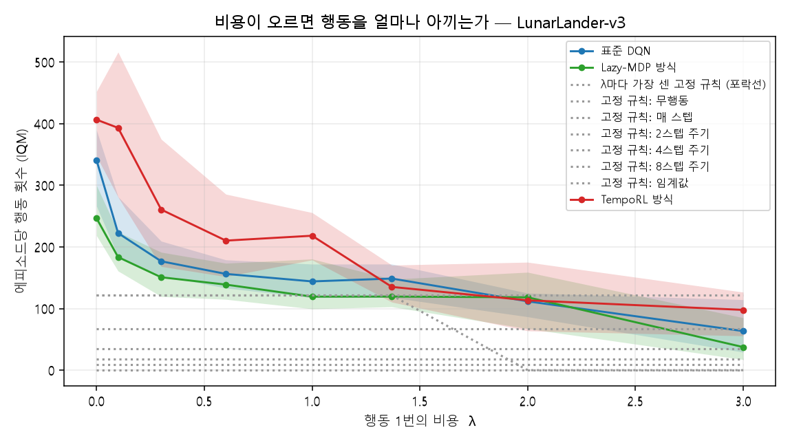
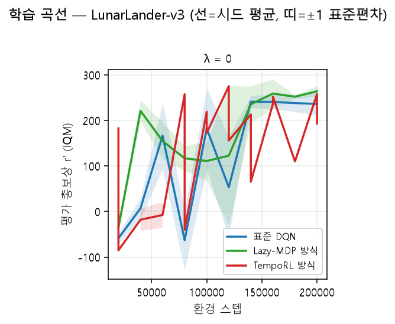
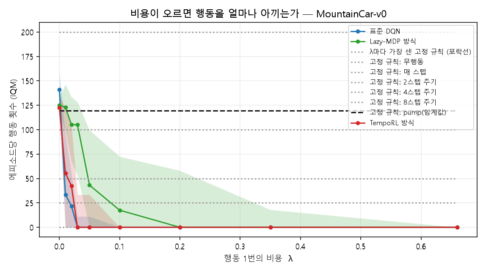
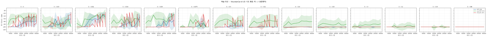

# 4장 · 결과

> **이 문서는 자동 생성된다.** `python -m src.report.make_results_chapter` 를 돌리면
> `results/aggregate/*.csv` 에서 숫자를 다시 읽어 이 파일을 덮어쓴다.
> 숫자를 손으로 고치지 말 것 — 다음 생성 때 사라지고, 그 사이 원고가 실험과 어긋난다.
> 해석과 논의는 5장(`05_논의.md`)에 사람이 쓴다.

## 4.1 읽는 법

- **λ**: 행동 1번의 값. 오른쪽으로 갈수록 행동이 비싸다. λ=0이면 원래 문제와 같다.
- **r'**: 비용까지 빼고 남은 총보상. 높을수록 좋다.
- **대괄호**: 95% 계층 부트스트랩 신뢰구간. 두 구간이 겹치면 우열을 말하지 않는다.
- **기준선**: 각 환경에서 가장 센 고정 규칙 (MountainCar는 pump 규칙, LunarLander는 임계값 규칙).
  문제를 아예 못 푸는 약한 규칙(무행동·주기)을 기준으로 삼으면 "학습이 이겼다"가 너무 쉬워진다.
- **λ\***: 학습이 그 기준 규칙을 더 이상 이기지 못하게 되는 가장 작은 λ.
  격자 안에서 교차가 없으면 보간하지 않고 "격자 안에 없음"이라고 적는다.

## 4.2 환경별 결과

### LunarLander-v3

보상이 조밀한 제어 문제. 표준 DQN이 정상적으로 학습된다. 조건당 환경 200,000스텝, 평가는 탐험을 끈 상태로 100 에피소드. 학습 계열은 λ 격자 8개 중 8개, 시드 10개까지 완료된 시점의 집계다.

#### 비용 반영 총보상 r' — IQM [95% 신뢰구간]

| 계열 / 규칙 | λ=0 | λ=0.1 | λ=0.3 | λ=0.6 | λ=1 | λ=1.37 | λ=2 | λ=3 |
|---|---|---|---|---|---|---|---|---|
| **표준 DQN** | 188.9 [171.3, 216.4] | 189.1 [143.0, 206.9] | 140.9 [99.5, 169.3] | 90.2 [62.1, 105.0] | -12.8 [-57.2, 35.2] | -60.7 [-86.1, -34.3] | -134.4 [-152.0, -114.6] | -209.9 [-330.3, -148.3] |
| **Lazy-MDP 방식** | 210.1 [179.6, 234.4] | 212.9 [169.2, 227.6] | 147.1 [127.8, 162.0] | 102.9 [54.0, 142.4] | 36.8 [-41.6, 65.6] | -47.0 [-68.0, -26.4] | -157.4 [-223.6, -110.0] | -174.7 [-267.1, -136.6] |
| **TempoRL 방식** | 159.1 [130.5, 181.6] | 118.9 [54.3, 176.8] | 80.7 [5.5, 156.3] | 59.4 [-4.0, 128.6] | -34.2 [-129.0, 23.9] | -52.2 [-98.1, -6.6] | -153.4 [-236.8, -127.6] | -286.0 [-341.0, -204.5] |
| rule_best | 35.8 [34.3, 37.6] | 23.6 [22.2, 25.4] | -0.7 [-2.1, 1.1] | -37.2 [-38.6, -35.3] | -85.7 [-87.4, -83.9] | -130.5 [-132.6, -128.8] | -131.3 [-133.4, -128.5] | -131.3 [-133.4, -128.5] |
| 무행동 | -131.3 [-133.4, -128.5] | -131.3 [-133.4, -128.5] | -131.3 [-133.4, -128.5] | -131.3 [-133.4, -128.5] | -131.3 [-133.4, -128.5] | -131.3 [-133.4, -128.5] | -131.3 [-133.4, -128.5] | -131.3 [-133.4, -128.5] |
| 매 스텝 주기 | -581.5 [-587.0, -575.8] | -588.2 [-593.7, -582.5] | -601.6 [-607.2, -596.0] | -621.7 [-627.5, -616.0] | -648.6 [-654.4, -642.8] | -673.4 [-679.4, -667.5] | -715.6 [-722.0, -709.4] | -782.7 [-789.5, -776.0] |
| 2스텝 주기 | -369.1 [-372.4, -363.9] | -372.5 [-375.8, -367.3] | -379.4 [-382.7, -374.1] | -389.7 [-393.2, -384.3] | -403.4 [-407.0, -397.9] | -416.1 [-419.8, -410.6] | -437.7 [-441.7, -432.2] | -471.9 [-476.3, -466.4] |
| 4스텝 주기 | -233.4 [-236.2, -231.6] | -235.2 [-237.9, -233.4] | -238.8 [-241.5, -237.0] | -244.2 [-246.9, -242.4] | -251.4 [-254.1, -249.6] | -258.0 [-260.8, -256.3] | -269.3 [-272.1, -267.6] | -287.3 [-290.1, -285.6] |
| 8스텝 주기 | -171.0 [-174.4, -168.3] | -172.0 [-175.4, -169.2] | -173.8 [-177.2, -171.1] | -176.6 [-180.0, -173.9] | -180.3 [-183.6, -177.6] | -183.7 [-187.1, -181.0] | -189.5 [-192.9, -186.9] | -198.7 [-202.1, -196.2] |
| 임계값 규칙 | 35.8 [34.3, 37.6] | 23.6 [22.2, 25.4] | -0.7 [-2.1, 1.1] | -37.2 [-38.6, -35.3] | -85.7 [-87.4, -83.9] | -130.5 [-132.6, -128.8] | -206.9 [-209.2, -205.2] | -328.1 [-330.6, -326.5] |

#### 에피소드당 행동 횟수 (IQM)

| 계열 | λ=0 | λ=0.1 | λ=0.3 | λ=0.6 | λ=1 | λ=1.37 | λ=2 | λ=3 |
|---|---|---|---|---|---|---|---|---|
| 표준 DQN | 340.8 | 222.5 | 176.7 | 156.2 | 144.0 | 148.7 | 111.7 | 63.4 |
| Lazy-MDP 방식 | 246.6 | 183.5 | 150.8 | 138.9 | 119.3 | 119.4 | 118.3 | 37.5 |
| TempoRL 방식 | 406.5 | 393.2 | 260.6 | 210.2 | 218.2 | 135.1 | 113.4 | 97.8 |
| 임계값 규칙 | 121.3 | 121.3 | 121.3 | 121.3 | 121.3 | 121.3 | 121.3 | 121.3 |

#### 임계 비용 λ\*

| 학습 계열 | λ\*CI (엄격) | λ\*점추정 (느슨) | 상태 |
|---|---|---|---|
| 표준 DQN | 3.0 | 격자 안에 없음 | 실험한 λ 전 구간에서 규칙을 이김 — λ*는 격자 최대값보다 큼 |
| Lazy-MDP 방식 | 2.0 | 격자 안에 없음 | 실험한 λ 전 구간에서 규칙을 이김 — λ*는 격자 최대값보다 큼 |
| TempoRL 방식 | 1.0 | 격자 안에 없음 | 실험한 λ 전 구간에서 규칙을 이김 — λ*는 격자 최대값보다 큼 |

- 표준 DQN은 비교된 λ 구간 전체에서 임계값 규칙을 이겼다 (8/8 λ 비교됨).
- Lazy-MDP 방식은 비교된 λ 구간 전체에서 임계값 규칙을 이겼다 (8/8 λ 비교됨).
- TempoRL 방식은 비교된 λ 구간 전체에서 임계값 규칙을 이겼다 (8/8 λ 비교됨).

### MountainCar-v0

보상이 희소한 탐험 문제. 표준 ε-greedy 탐험으로는 목표에 닿지 못한다. 조건당 환경 300,000스텝, 평가는 탐험을 끈 상태로 100 에피소드. 학습 계열은 λ 격자 9개 중 9개, 시드 10개까지 완료된 시점의 집계다.

#### 비용 반영 총보상 r' — IQM [95% 신뢰구간]

| 계열 / 규칙 | λ=0 | λ=0.01 | λ=0.02 | λ=0.03 | λ=0.05 | λ=0.1 | λ=0.2 | λ=0.35 | λ=0.66 |
|---|---|---|---|---|---|---|---|---|---|
| **표준 DQN** | -160.4 [-179.9, -142.0] | -197.5 [-200.1, -181.2] | -200.4 [-201.1, -200.0] | -200.0 [-200.3, -200.0] | -200.0 [-200.6, -200.0] | -200.0 [-200.0, -200.0] | -200.0 [-200.0, -200.0] | -200.0 [-200.0, -200.0] | -200.0 [-200.0, -200.0] |
| **Lazy-MDP 방식** | -127.9 [-152.3, -117.8] | -155.8 [-174.4, -133.9] | -159.1 [-189.1, -129.1] | -167.4 [-201.0, -133.1] | -187.2 [-200.0, -158.6] | -191.5 [-200.0, -159.5] | -200.0 [-204.4, -190.6] | -200.0 [-202.0, -197.8] | -200.0 [-200.0, -200.0] |
| **TempoRL 방식** | -141.4 [-159.3, -128.7] | -192.8 [-200.3, -167.4] | -200.2 [-200.9, -182.4] | -200.0 [-201.0, -200.0] | -200.0 [-201.7, -200.0] | -200.0 [-200.0, -200.0] | -200.0 [-200.0, -200.0] | -200.0 [-200.0, -200.0] | -200.0 [-200.0, -200.0] |
| rule_best | -119.3 [-119.6, -119.1] | -120.5 [-120.8, -120.3] | -121.7 [-122.0, -121.5] | -122.9 [-123.2, -122.6] | -125.3 [-125.6, -125.0] | -131.3 [-131.5, -131.0] | -143.2 [-143.5, -142.9] | -161.1 [-161.4, -160.7] | -198.1 [-198.5, -197.7] |
| 무행동 | -200.0 [-200.0, -200.0] | -200.0 [-200.0, -200.0] | -200.0 [-200.0, -200.0] | -200.0 [-200.0, -200.0] | -200.0 [-200.0, -200.0] | -200.0 [-200.0, -200.0] | -200.0 [-200.0, -200.0] | -200.0 [-200.0, -200.0] | -200.0 [-200.0, -200.0] |
| 매 스텝 주기 | -200.0 [-200.0, -200.0] | -202.0 [-202.0, -202.0] | -204.0 [-204.0, -204.0] | -206.0 [-206.0, -206.0] | -210.0 [-210.0, -210.0] | -220.0 [-220.0, -220.0] | -240.0 [-240.0, -240.0] | -270.0 [-270.0, -270.0] | -332.0 [-332.0, -332.0] |
| 2스텝 주기 | -200.0 [-200.0, -200.0] | -201.0 [-201.0, -201.0] | -202.0 [-202.0, -202.0] | -203.0 [-203.0, -203.0] | -205.0 [-205.0, -205.0] | -210.0 [-210.0, -210.0] | -220.0 [-220.0, -220.0] | -235.0 [-235.0, -235.0] | -266.0 [-266.0, -266.0] |
| 4스텝 주기 | -200.0 [-200.0, -200.0] | -200.5 [-200.5, -200.5] | -201.0 [-201.0, -201.0] | -201.5 [-201.5, -201.5] | -202.5 [-202.5, -202.5] | -205.0 [-205.0, -205.0] | -210.0 [-210.0, -210.0] | -217.5 [-217.5, -217.5] | -233.0 [-233.0, -233.0] |
| 8스텝 주기 | -200.0 [-200.0, -200.0] | -200.2 [-200.2, -200.2] | -200.5 [-200.5, -200.5] | -200.8 [-200.8, -200.8] | -201.3 [-201.3, -201.3] | -202.5 [-202.5, -202.5] | -205.0 [-205.0, -205.0] | -208.8 [-208.8, -208.8] | -216.5 [-216.5, -216.5] |
| pump(임계값) 규칙 | -119.3 [-119.6, -119.1] | -120.5 [-120.8, -120.3] | -121.7 [-122.0, -121.5] | -122.9 [-123.2, -122.6] | -125.3 [-125.6, -125.0] | -131.3 [-131.5, -131.0] | -143.2 [-143.5, -142.9] | -161.1 [-161.4, -160.7] | -198.1 [-198.5, -197.7] |

#### 에피소드당 행동 횟수 (IQM)

| 계열 | λ=0 | λ=0.01 | λ=0.02 | λ=0.03 | λ=0.05 | λ=0.1 | λ=0.2 | λ=0.35 | λ=0.66 |
|---|---|---|---|---|---|---|---|---|---|
| 표준 DQN | 141.1 | 33.5 | 21.8 | 0.0 | 0.0 | 0.0 | 0.0 | 0.0 | 0.0 |
| Lazy-MDP 방식 | 125.2 | 122.8 | 105.2 | 105.0 | 43.1 | 17.5 | 0.0 | 0.0 | 0.0 |
| TempoRL 방식 | 122.6 | 55.6 | 42.5 | 0.0 | 0.0 | 0.0 | 0.0 | 0.0 | 0.0 |
| pump(임계값) 규칙 | 119.3 | 119.3 | 119.3 | 119.3 | 119.3 | 119.3 | 119.3 | 119.3 | 119.3 |

#### 임계 비용 λ\*

| 학습 계열 | λ\*CI (엄격) | λ\*점추정 (느슨) | 상태 |
|---|---|---|---|
| 표준 DQN | 0.0 | 0.0 | λ=0에서도 규칙을 못 이김 — 비용 때문이 아니라 학습 자체가 규칙보다 약함 |
| Lazy-MDP 방식 | 0.0 | 0.0 | λ=0에서도 규칙을 못 이김 — 비용 때문이 아니라 학습 자체가 규칙보다 약함 |
| TempoRL 방식 | 0.0 | 0.0 | λ=0에서도 규칙을 못 이김 — 비용 때문이 아니라 학습 자체가 규칙보다 약함 |

- 표준 DQN은 λ=0에서도 pump(임계값) 규칙을 이기지 못했다. 비용 때문이 아니라 학습된 정책 자체가 규칙보다 약하다는 뜻이다.
- Lazy-MDP 방식은 λ=0에서도 pump(임계값) 규칙을 이기지 못했다. 비용 때문이 아니라 학습된 정책 자체가 규칙보다 약하다는 뜻이다.
- TempoRL 방식은 λ=0에서도 pump(임계값) 규칙을 이기지 못했다. 비용 때문이 아니라 학습된 정책 자체가 규칙보다 약하다는 뜻이다.

---

*출처: `results/aggregate/{LunarLander-v3,MountainCar-v0}_iqm.csv`, `*_lambda_star.json`. 조건별 원본은 `results/raw/{환경}/{계열}/lam{λ}/seed{n}_final.csv`. 설계 결정과 도중에 고친 버그는 `docs/실험일지.md` 참조.*
